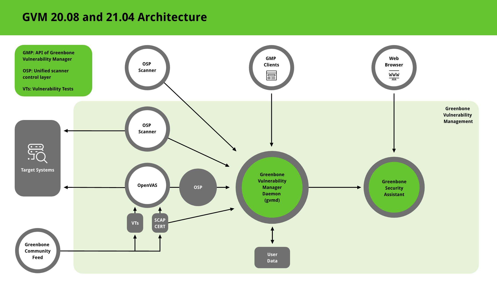

GVM Architecture
****************

.. toctree::
   :maxdepth: 3
   
   architecture

The Greenbone Vulnerability Management (GVM) is a framework of several services.
It is developed as part of the commercial product line `Greenbone Professional Edition`_.
The following figure shows an overview of the architecture for GVM 20.08 and
GVM 21.04.

  Architecture of GVM 20.08 and 21.04

GVM is grouped into three major parts

* Scanner
* Manager
* Web interface

Background
==========

GVM is a originally built as a community project named *OpenVAS* and is primarily developed and forwarded by Greenbone Networks.

It is grouped into three major parts

* Executable scan application that runs vulnerability tests (VT) against target systems
* Greenbone Vulnerability Manager Daemon (gvmd)
* Greenbone Security Assistant (GSA) with the Greenbone Security Assistant Daemon (gsad)

The GVM framework is released under Open Source licenses as the Greenbone Source Edition (GSE).
 By using it, Linux distributions can create and provide GVM in the form of installation packages.

Greenbone Vulnerability Manager Daemon (gvmd)
=============================================

The `Greenbone Vulnerability Manager (gvmd)`_ is the central service that consolidates plain vulnerability scanning into a full vulnerability management solution.
gvmd controls the OpenVAS Scanner via Open Scanner Protocol (OSP).

The service itself offers the XML-based, stateless Greenbone Management Protocol (GMP).
gvmd also controls an SQL database (PostgreSQL) where all configuration and scan result data is centrally stored.
Furthermore, gvmd also handles user management including permissions control with groups and roles.
And finally, the service has an internal runtime system for scheduled tasks and other events.

Greenbone Security Assistant (GSA)
==================================

The `Greenbone Security Assistant (GSA)`_ is the web interface of GVM that a user controls scans and accesses vulnerability information with.
It the main contact point for a user with GVM.
It connects to gvmd via the web server Greenbone Security Assistant Daemon (gsad) to provide a full-featured web application for vulnerability management.
The communication occurs using the Greenbone Management Protocol (GMP) with which the user can also communicate directly by using different tools.

OpenVAS Scanner
===============

The main scanner `OpenVAS Scanner`_ is a full-featured scan engine that executes vulnerability tests (VTs) against target systems.
For this, it uses the daily updated and comprehensive feeds: the full-featured, extensive, commercial Greenbone Security Feed (GSF) or the free available Greenbone Community Feed (GCF).

The scanner consists of the components `ospd-openvas`_ and `openvas-scanner`_.
The OpenVAS Scanner is controlled via OSP.
The OSP Daemon for the OpenVAS Scanner (ospd-openvas) communicates with gvmd via OSP: VT data is collected, scans are started and stopped, and scan results are transferred to gvmd via ospd.

Other (maybe think of a better heading :D)
==========================================

OSP Scanner
^^^^^^^^^^^

Users can develop and connect their own OSP scanners using the generic ospd scanner framework.
An (generic) OSP scanner example which can be used as an OSP scanner template can be found `here`_.

GMP Clients
^^^^^^^^^^^

The `Greenbone Vulnerability Management Tools (gvm-tools)`_ are a collection of tools that help with remote controlling a Greenbone Security Manager (GSM) appliance and its underlying Greenbone Vulnerability Manager Daemon (gvmd).
The tools aid in accessing the communication protocols GMP (Greenbone Management Protocol) and OSP (Open Scanner Protocol).

This module is comprised of interactive and non-interactive clients. 
The programming language Python is supported directly for interactive scripting.
But it is also possible to issue remote GMP/OSP commands without programming in Python.

.. _Greenbone Professional Edition: https://www.greenbone.net/en/solutions/
.. _ospd-openvas: https://github.com/greenbone/ospd-openvas
.. _openvas-scanner: https://github.com/greenbone/openvas-scanner
.. _OpenVAS Scanner: https://github.com/greenbone/openvas-scanner
.. _Greenbone Vulnerability Manager (gvmd): https://github.com/greenbone/gvmd
.. _Greenbone Security Assistant (GSA): https://github.com/greenbone/gsa
.. _here: https://github.com/greenbone/ospd-example-scanner
.. _Greenbone Vulnerability Management Tools (gvm-tools): https://github.com/greenbone/gvm-tools
